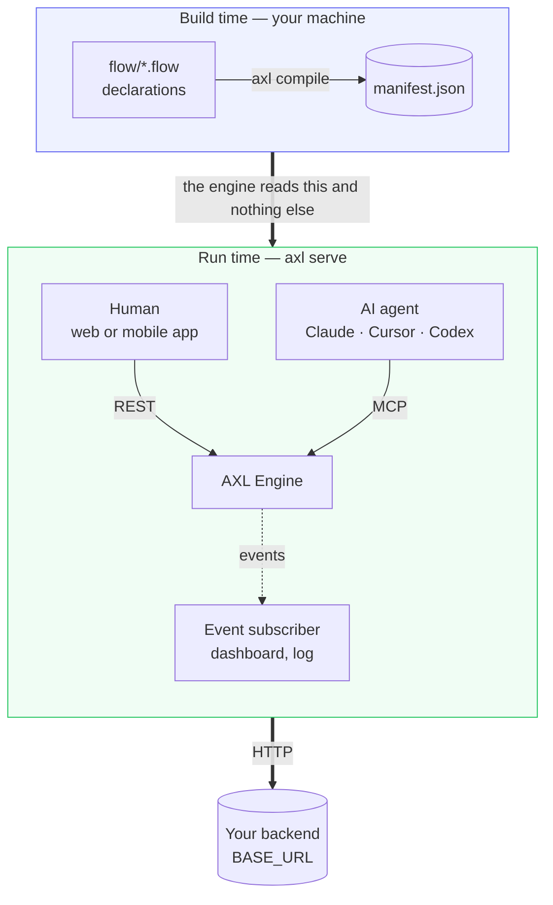
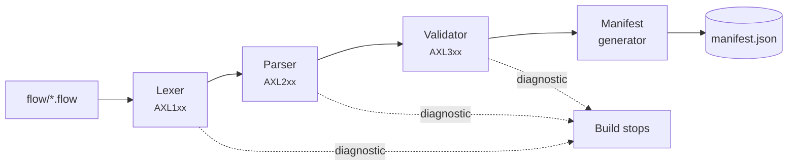
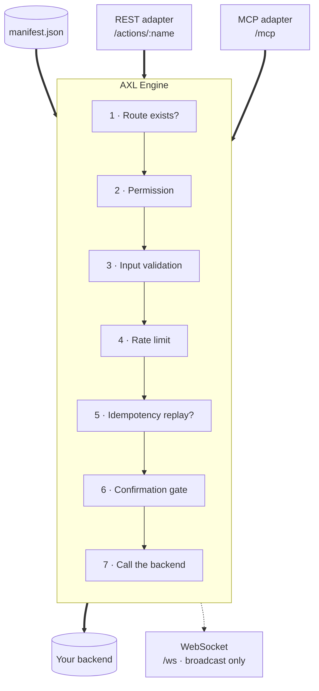
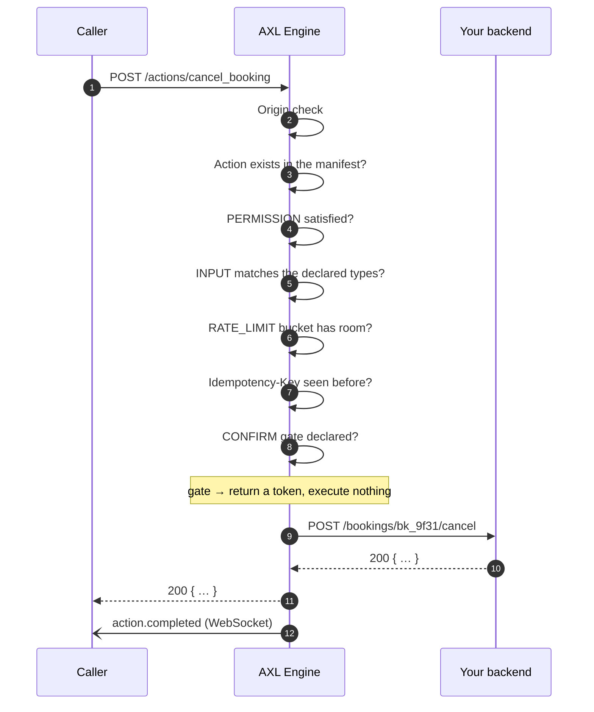
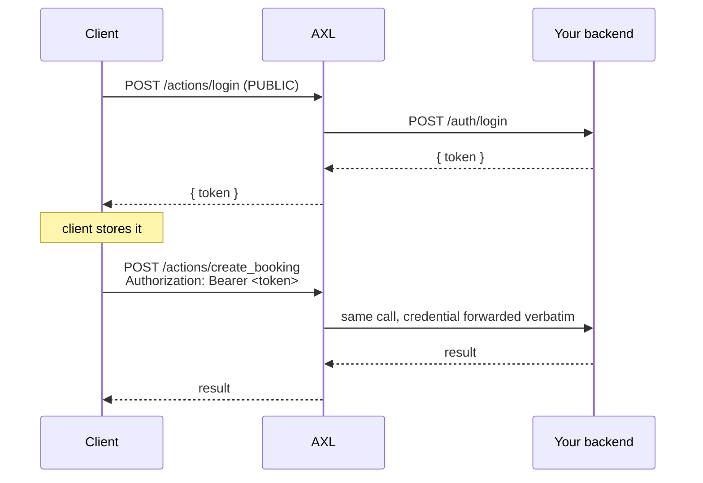
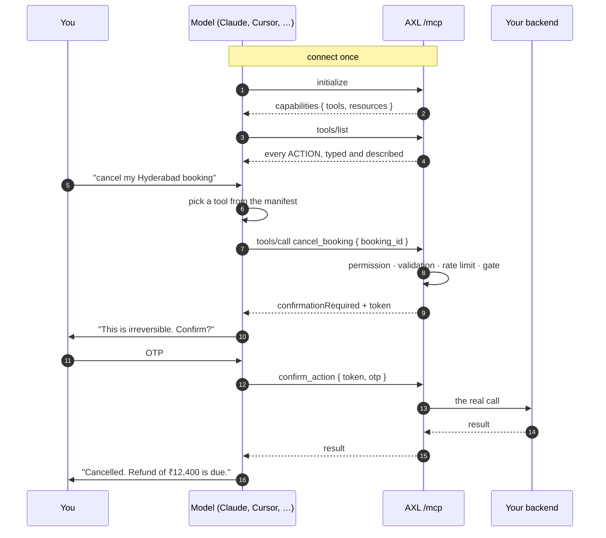
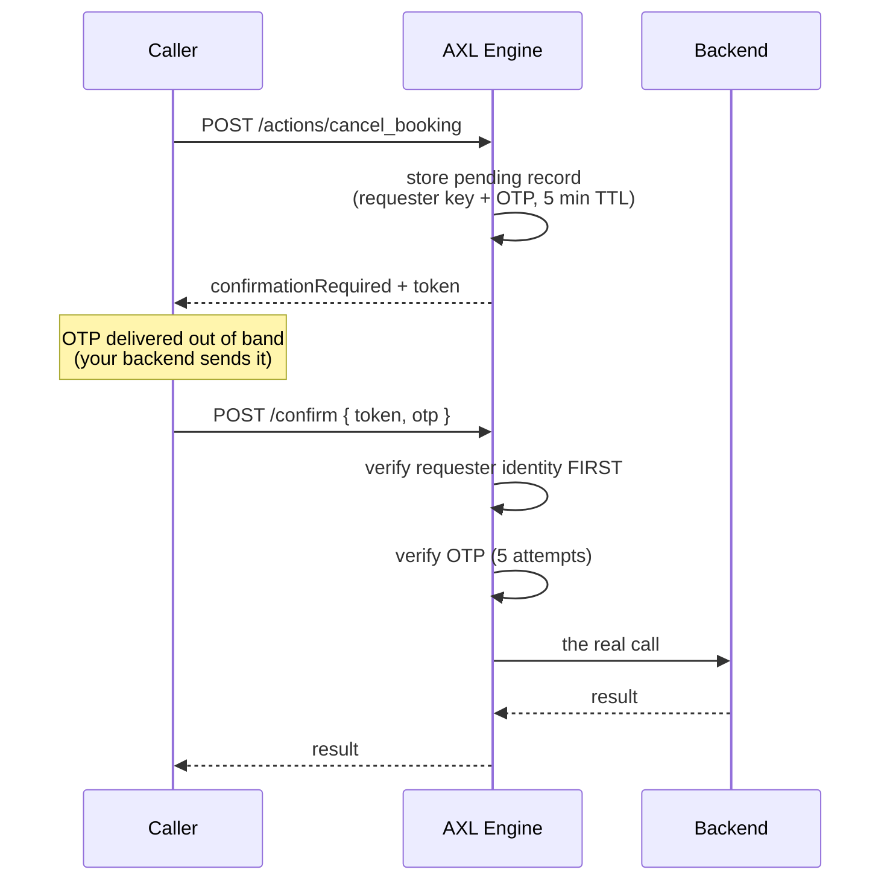
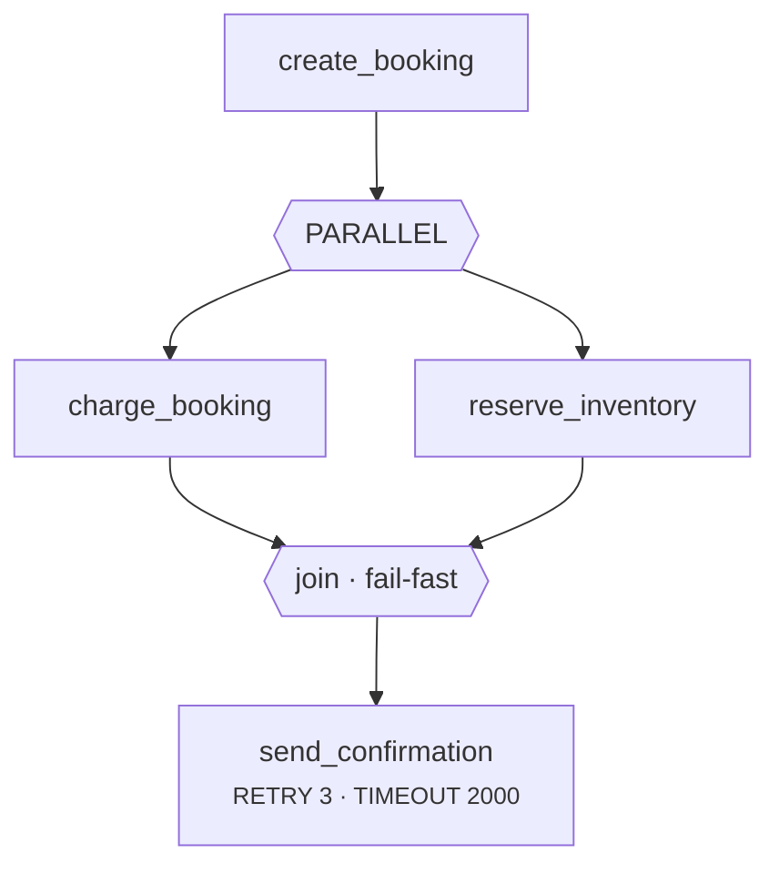

<div align="center">


# How AXL Works

**A complete walkthrough: the problem, the model, the machinery, and what a person,
an agent and an operator each see.**

</div>

Every command output, manifest excerpt, HTTP response and MCP payload on this page was
captured from a real run against a real server. Nothing here is illustrative.

---

## Contents

- [1. The problem](#1-the-problem)
- [2. The model in one picture](#2-the-model-in-one-picture)
- [3. The pieces](#3-the-pieces)
- [4. What you write](#4-what-you-write)
- [5. What the compiler does](#5-what-the-compiler-does)
- [6. The manifest](#6-the-manifest)
- [7. What the runtime does](#7-what-the-runtime-does)
- [8. The lifecycle of one request](#8-the-lifecycle-of-one-request)
- [9. How a human uses it](#9-how-a-human-uses-it)
- [10. How an AI agent uses it](#10-how-an-ai-agent-uses-it)
- [11. Human-in-the-loop: confirmation gates](#11-human-in-the-loop-confirmation-gates)
- [12. Workflows](#12-workflows)
- [13. Events](#13-events)
- [14. How an operator uses it](#14-how-an-operator-uses-it)
- [15. The security posture, end to end](#15-the-security-posture-end-to-end)
- [16. Where AXL fits, and where it does not](#16-where-axl-fits-and-where-it-does-not)
- [17. Glossary](#17-glossary)

---

## 1. The problem

You have a backend. It works. It has routes, a database, auth, and a web client that talks
to it.

Now something else wants in: an AI agent. Claude, Cursor, Codex, an in-house assistant. To
let an agent act on your product you have to expose your capabilities as **tools** — typed,
described, discoverable. So you write an MCP server.

That MCP server is a second implementation of your API surface. And the moment it exists,
you own a synchronisation problem that gets worse every week:

| What drifts | What it costs |
|---|---|
| A new field on the web API, not on the tool | The agent works from a stale contract |
| A permission check in the REST handler, not in the tool handler | **The agent path is the unguarded one** |
| A tool description that describes last quarter's behaviour | The model confidently does the wrong thing |
| A destructive action with a confirmation dialog in the UI and none in the tool | The agent deletes without asking |

The third and fourth rows are the dangerous ones. A hand-written MCP server has no
mechanism that forces a tool's description, schema and permission to stay true. They are
prose and code in separate files, kept in agreement by memory.

**AXL's answer: don't write the second implementation. Declare the capability once and
compile both surfaces from it.**

The declaration is checked at build time. A capability with no permission does not compile.
A rate limit the engine cannot enforce does not compile. A tool whose schema disagrees with
its endpoint is not expressible.

---

## 2. The model in one picture



Three properties fall out of that shape, and they are the whole design:

**One source.** REST and MCP are not two implementations. They are two adapters over one
engine reading one manifest. A permission cannot exist on one path and not the other,
because there is one place permissions are checked.

**A hard build boundary.** The engine reads `manifest.json` and nothing else. It never sees
a `.flow` file; the compiler never runs in production. A malformed spec cannot reach a live
server, because the artefact a live server loads cannot be produced from one.

**Your backend is untouched.** AXL calls it over HTTP at the `BASE_URL` you declare. No
SDK, no migration, no rewrite. Your routes stay exactly as they are.

---

## 3. The pieces

```
axl/
├── packages/
│   ├── compiler/     @silvercloudlabs/compiler    lexer → parser → validator → manifest generator
│   ├── runtime/      @silvercloudlabs/runtime     engine, transport adapters, state stores
│   ├── cli/          scl-axl          the `axl` binary
│   ├── generators/   @silvercloudlabs/generators  artifact generators (DIAGRAM)
│   └── vscode/       axl-flow         editor support for .flow
```

| Package | Runs | Responsibility |
|---|---|---|
| `@silvercloudlabs/compiler` | Build time | Turns `.flow` text into a validated `manifest.json`, or into diagnostics with a file and a line |
| `@silvercloudlabs/runtime` | Run time | The engine: permissions, validation, gates, rate limits, idempotency, orchestration, events |
| `scl-axl` | Both | `axl compile`, `axl serve`, `axl inspect`, and the rest |
| `@silvercloudlabs/generators` | Build time | Optional artifacts declared with `GENERATORS` |
| `axl-flow` | Your editor | Highlighting, hovers, diagnostics from the real compiler, snippets |

All five version in **lockstep**, so one version number describes the whole toolchain.

---

## 4. What you write

A project is a `flow/` directory and an `axl.config.json`. Up to six files; only
`app.flow` is required.

| File | Declares |
|---|---|
| `app.flow` | Name, version, the backend `BASE_URL`, generator outputs |
| `schema.flow` | `ENTITY` — your data shapes |
| `actions.flow` | `ACTION` — things that change something |
| `resources.flow` | `RESOURCE` — things that only read |
| `workflows.flow` | `WORKFLOW` — ordered multi-step orchestration |
| `auth.flow` | `PERMISSION`, `CONFIRM`, `RATE_LIMIT` |

No braces, no semicolons, no expressions. Comments start with `--`. Indentation is
aesthetic. `.flow` is deliberately **not** Turing-complete: every line is a declaration,
which is what makes the whole file checkable.

### The four files that matter, for one capability

```flow
-- app.flow
APP hotelbooking
NAME "Hotel Booking"
VERSION 1.0.0
BASE_URL https://api.hotels.example/api
```

```flow
-- schema.flow
ENTITY Hotel
  id       : String
  name     : String
  city     : String
  rating   : Float
  featured : Boolean
```

```flow
-- actions.flow
ACTION search_hotels
  DESC "Search bookable hotels by city"
  INPUT
    city       : String REQUIRED DESC "City name, e.g. Hyderabad"
    min_rating : Float OPTIONAL DESC "Only return hotels rated at or above this"
  OUTPUT List<Hotel>
  ENDPOINT GET /hotels

ACTION cancel_booking
  DESC "Cancel a booking and release the room"
  INPUT
    booking_id : String REQUIRED DESC "ID of the booking to cancel"
  OUTPUT Booking
  ENDPOINT POST /bookings/{booking_id}/cancel
  IRREVERSIBLE true
  EFFECTS "Releases the room back to inventory and voids the reservation"
```

```flow
-- auth.flow
PERMISSION search_hotels  : PUBLIC
PERMISSION cancel_booking : AUTH
CONFIRM    cancel_booking : OTP
RATE_LIMIT search_hotels  : 60/min
```

Three things in there are doing more work than they look like they are.

**`DESC` on each input.** It is carried into the MCP tool schema, so a model sees what a
parameter *means*, not just its type. This is the single highest-leverage thing you can
write in a `.flow` file if agents will call your API.

**`IRREVERSIBLE` and `EFFECTS`.** Appended to the MCP tool description. They are the only
channel through which a model learns the consequence of calling something. Section 10 shows
exactly what the agent receives.

**`PERMISSION` is mandatory.** Omit it and the build fails with `AXL322`. There is no
default, because every plausible default is wrong: `PUBLIC` silently exposes, `AUTH`
silently breaks.

---

## 5. What the compiler does



Four stages, in order. A failure at any stage stops the build — it never emits a partial
manifest.

| Stage | Codes | Rejects, for example |
|---|---|---|
| Lexer | `AXL1xx` | An unterminated string, an illegal character |
| Parser | `AXL2xx` | `INPUT` on a `RESOURCE` (`AXL232`), a malformed block |
| Validator | `AXL3xx` | Missing `PERMISSION` (`AXL322`), unknown type (`AXL310`), circular entities (`AXL342`), unenforceable rate limit (`AXL388`), a `PARALLEL` member binding from a sibling (`AXL335`) |
| Driver | `AXL4xx` | Project-level warnings — a missing or empty expected file |

The validator is where most of the value is. A sample of what it refuses to let you ship:

| Code | Refuses |
|---|---|
| `AXL322` / `AXL329` | An action or resource with no `PERMISSION` |
| `AXL326` | A `RESOURCE` on any method but `GET` |
| `AXL334` | `CONFIRM` on a `RESOURCE` — a read has nothing to confirm |
| `AXL363` | `OWNER x` where `x` is not an input of that action — it could never match, so the action would be permanently denied |
| `AXL388` | `RATE_LIMIT a : 100/hour`. The units are `sec`, `min`, `hr`, `day` |
| `AXL381` | `CONFIRM` inside a `PARALLEL` block |
| `AXL374` | Event-based `WAIT` — it needs a durable scheduler that does not exist |

Each of those is a decision, not a limitation. `AXL363` is the clearest example: without it
a typo in an `OWNER` clause produces an action that denies every request forever, and you
find out in production.

A real failure, with the real output:

```console
$ axl compile

  Compiling flow → manifest

  ✖ AXL388  auth.flow:4:1
  │
  │  RATE_LIMIT search_hotels : 100/hour is not a valid rate limit
  │
  = help    Use "100/hr". Valid units are sec, min, hr and day.
```

Before 1.5.0 that line compiled clean and applied **no limit at all**. The rate limit was
in the spec, printed by `axl inspect`, and enforced nowhere.

---

## 6. The manifest

`axl compile` emits one file. This is the real thing, from the `hotel-booking` example:

```console
$ axl compile
  Compiling flow → manifest

  ✔ Compiled successfully
  Done in 19ms
```

```json
{
  "axl_version": "1.0",
  "app": {
    "name": "hotel-booking",
    "version": "1.0.0",
    "base_url": "http://localhost:3000/api",
    "generators": ["DIAGRAM"]
  },
  "entities": [ … ],
  "actions": { … },
  "resources": { … },
  "workflows": [ … ],
  "permissions": { … },
  "rateLimits": { … }
}
```

One action, exactly as it appears on disk:

```json
{
  "description": "Search bookable hotels by city",
  "input": {
    "city": {
      "type": "string",
      "required": true,
      "description": "City name, e.g. Hyderabad"
    },
    "min_rating": {
      "type": "float",
      "required": false,
      "description": "Only return hotels rated at or above this"
    }
  },
  "output": "List<Hotel>",
  "endpoint": { "method": "GET", "path": "/hotels" },
  "permission": "PUBLIC",
  "confirm": null
}
```

Everything the runtime needs is in there, and nothing else is. There is no code in a
manifest — it is data, which is the point of the build boundary. The runtime loads data, so
a manifest cannot do anything at load time.

The manifest is also served publicly at `GET /manifest.json`. That is deliberate: it is a
discovery contract. It contains your *capability surface*, never your data.

---

## 7. What the runtime does



`axl serve` starts all three transports together — there is no flag to enable one:

```console
$ axl serve

  AXL Server
  ✔ Running (MCP + REST + WS)

  Health        http://localhost:3939/health
  Discovery     http://localhost:3939/.well-known/axl
  MCP Endpoint  http://localhost:3939/mcp
  REST API      http://localhost:3939/actions/:name
  WS API        ws://localhost:3939/ws
  Listening on  127.0.0.1:3939
```

It binds **loopback only** by default, on both `127.0.0.1` and `::1`. Going public is an
explicit `--host`.

### Two RPC transports, not three

REST and MCP can both invoke actions. **The WebSocket cannot.** Its only inbound message
type is `ping`, answered with `pong`; everything else it does is server-to-client
broadcast. A third invocation path would be a third place for the permission model to be
applied slightly differently.

### State the engine keeps

AXL holds no domain data. Everything it persists is mechanism:

| Store | Contents | TTL |
|---|---|---|
| Pending confirmations | Requester key and OTP for a gated action awaiting its second call | 5 minutes |
| Paused workflows | Cursor and step outputs for a workflow stopped at a gate | 24 hours |
| Idempotency cache | Prior results, keyed by `Idempotency-Key` **and session** | 24 hours |
| Rate-limit buckets | Counts per IP, and per session where one exists | The declared window |

In memory by default; `--state-file` persists them across restarts.

---

## 8. The lifecycle of one request



Every stage before step 9 can end the request. **None of them ever reaches your backend.**
That is the practical value of the model: an unauthorised, malformed, over-quota or
unconfirmed call costs your backend nothing, because it never arrives.

Order matters and is fixed. Permission is checked before validation, so an unauthorised
caller cannot use error messages to map your input schema. The requester's identity is
checked before an OTP is read, so a stranger holding a leaked token cannot burn the owner's
attempt budget.

---

## 9. How a human uses it

A web or mobile client speaks ordinary REST. Nothing about AXL is visible to it.

```console
$ curl -s -X POST http://127.0.0.1:3939/actions/search_hotels \
    -H 'Content-Type: application/json' \
    -d '{"city":"Hyderabad","min_rating":4.7}'

[{"id":"h_taj","name":"Taj Krishna","city":"Hyderabad","rating":4.8,"featured":true}]
```

`search_hotels` is `PUBLIC`, so that worked with no credential. An `AUTH` action without a
session is refused before it reaches the backend:

```console
$ curl -s -X POST http://127.0.0.1:3939/actions/create_booking \
    -H 'Content-Type: application/json' -d '{}'

{
  "type": "PERMISSION_DENIED",
  "title": "Permission denied",
  "status": 403,
  "detail": "This action requires authentication. No session provided.",
  "instance": "/actions/create_booking#f59acce2-de1a-403d-a66a-b406e8b7b3a6"
}
```

Errors are **RFC 7807 `application/problem+json`**. `type` is the stable machine-readable
code; `instance` is `<path>#<request-id>`, so it identifies *this* occurrence rather than
being identical across every error on the route.

There is no `401` anywhere in AXL. A missing session is `403 PERMISSION_DENIED`, because
AXL issues no challenge — a `WWW-Authenticate` header would name a scheme it does not
implement.

### Sessions

AXL never issues, stores or validates a credential.



`login` is an action **you** declare, backed by **your** route. AXL checks that a session
*exists* for `AUTH`; whether it is *valid* is decided by your backend when the proxied call
arrives. This is why AXL is not an auth system and does not try to be.

### Rate limits are real

A live demonstration against `RATE_LIMIT ping : 2/min`:

```console
req 1 -> {"ok":true,"path":"/api/ping"}                              [200]
req 2 -> {"ok":true,"path":"/api/ping"}                              [200]
req 3 -> {"type":"RATE_LIMIT_EXCEEDED","status":429,
          "detail":"Rate limit exceeded for action \"ping\".",
          "next_action":"retry_after","retry_after":60}              [429]
req 4 -> {"type":"RATE_LIMIT_EXCEEDED","status":429, … }             [429]
```

Quotas are anchored to the **source IP**, always. A session adds a second, narrower bucket;
it never replaces the first. Keying only on the bearer token would be bypassable by
rotating the `Authorization` header, since AXL never validates it.

---

## 10. How an AI agent uses it

This is the half that does not exist without AXL, so it is worth showing in full.



The agent connects to `/mcp` over Streamable HTTP. One `tools/list` and it knows your
entire capability surface — generated from the same manifest that serves your web client,
so it cannot be out of date.

### What the model actually receives

Real `tools/list` output, unedited:

```json
{
  "name": "search_hotels",
  "description": "Search bookable hotels by city",
  "inputSchema": {
    "type": "object",
    "properties": {
      "city": {
        "type": "string",
        "description": "City name, e.g. Hyderabad"
      },
      "min_rating": {
        "type": "number",
        "description": "Only return hotels rated at or above this"
      }
    },
    "required": ["city"]
  }
}
```

The `description` on each property is your `DESC`. Without it the model gets
`{"type":"string"}` and a parameter name, and has to guess.

### Consequence metadata is the whole point

Here is `cancel_booking` as the model sees it. Compare it against the `.flow` in section 4:

```json
{
  "name": "cancel_booking",
  "description": "Cancel a booking and release the room [IRREVERSIBLE: this action cannot be undone] [Effects: Releases the room back to inventory and voids the reservation] (requires human confirmation before executing)",
  "inputSchema": {
    "type": "object",
    "properties": {
      "booking_id": { "type": "string", "description": "ID of the booking to cancel" }
    },
    "required": ["booking_id"]
  }
}
```

Three declarations — `IRREVERSIBLE true`, `EFFECTS "…"`, and `CONFIRM cancel_booking : OTP`
— became one sentence that tells a model, before it acts, that this is destructive, what it
destroys, and that a human has to approve it.

A hand-written MCP server can produce that string too. What it cannot do is guarantee the
string stays true when someone changes the action six months from now. Here the string is
generated from the declaration, and the declaration is what the engine enforces.

### Mapping

| `.flow` | MCP |
|---|---|
| `ACTION` | Tool — `tools/list`, `tools/call` |
| `RESOURCE` | Resource — `resources/list`, `resources/read`, URI `axl://resource/<name>` |
| `DESC` on an action | Tool description |
| `DESC` on an input | Parameter description in the tool schema |
| `IRREVERSIBLE` / `EFFECTS` / `SIDE_EFFECTS` | Appended to the tool description |
| `CONFIRM` | `(requires human confirmation before executing)`, plus the runtime gate |
| `WORKFLOW` | `run_workflow` / `resume_workflow` tools |

A `RESOURCE` is **never** registered as a zero-argument tool. That would put a read into
the mutation menu and leave `resources/list` empty.

`capabilities.resources` is derived from the manifest, not hardcoded — a project with no
resources advertises `false`, because advertising a capability whose listing is empty is a
lie a client will act on.

### The permission model applies identically

An agent is a client like any other. `AUTH` needs a session, `ROLE staff` needs a verified
role claim, rate limits count the same buckets, confirmation gates fire the same way. There
is no "agent mode" and no privileged path — which is the reason there is one engine rather
than two adapters with their own checks.

### Connecting one

```bash
# Claude Code
claude mcp add --transport http my-app http://127.0.0.1:3939/mcp
```

```json
// Cursor — ~/.cursor/mcp.json
{
  "mcpServers": {
    "my-app": { "type": "http", "url": "http://127.0.0.1:3939/mcp" }
  }
}
```

---

## 11. Human-in-the-loop: confirmation gates

`CONFIRM <action> : OTP` means the action does not execute on first call — from **any**
transport, by **any** caller.



The real exchange, captured:

```console
$ curl -s -X POST http://127.0.0.1:3939/actions/cancel_booking \
    -H 'Authorization: Bearer sess_abc' -d '{"booking_id":"bk_9f31"}'
{
  "confirmationRequired": true,
  "next_action": "confirm_action",
  "token": "15c2831d-0e1e-476e-af27-88d9f305af80",
  "otp_demo_only": "349202",
  "message": "Action \"cancel_booking\" requires confirmation. Call confirm_action with this token and the OTP."
}

$ curl -s -X POST http://127.0.0.1:3939/confirm \
    -H 'Authorization: Bearer sess_abc' \
    -d '{"token":"15c2831d-…","otp":"000000"}'
{ "type": "VALIDATION_ERROR", "detail": "Incorrect OTP. 4 attempt(s) remaining." }

$ curl -s -X POST http://127.0.0.1:3939/confirm \
    -H 'Authorization: Bearer sess_abc' \
    -d '{"token":"15c2831d-…","otp":"349202"}'
{ "id": "bk_9f31", "status": "cancelled", "refund_due": 12400 }
```

`otp_demo_only` appears **only** under `AXL_DEMO_OTP=1`, which is off by default. In a real
deployment the OTP is delivered by your backend — email, SMS, authenticator — because
delivery is a backend concern.

Two details that are load-bearing:

**The requester check runs before the OTP is read.** A mismatch raises the same `NOT_FOUND`
as an unknown token, deliberately, so `/confirm` is not a token-existence oracle — and a
stranger holding a leaked token cannot exhaust the owner's five attempts.

**Failed confirmations are capped per client across all tokens** — 20 per 15 minutes — not
just per token. Without that, an attacker rotates tokens and the per-token lockout is
meaningless.

For an agent this is the mechanism that puts a person in the loop. The model receives a
token instead of a result, and the only way forward is a code it cannot obtain by itself.

---

## 12. Workflows

A workflow orders actions and binds their outputs together. It runs **inline** on the
originating request — there is no background worker.

```flow
WORKFLOW BookingCheckout
  STEP create_booking
  PARALLEL
    STEP charge_booking     USING booking_id = create_booking.id
    STEP reserve_inventory  USING booking_id = create_booking.id
  END
  STEP send_confirmation    USING booking_id = create_booking.id RETRY 3 TIMEOUT 2000
END
```



| Form | Purpose |
|---|---|
| `STEP <action>` | Invoke an action |
| `USING <input> = <step>.<field>` | Bind an argument from an earlier step's output |
| `RETRY <n>` | Retry on backend failure |
| `TIMEOUT <ms>` | Deadline **per attempt** |
| `WAIT <ms>` | Fixed pause |
| `IF` / `ELSE` / `END` | Two-way branch |
| `SWITCH` / `CASE` / `DEFAULT` / `END` | Multi-way branch |
| `PARALLEL` / `END` | Concurrent block |

Semantics that will bite you if you assume otherwise:

| Construct | Behaviour |
|---|---|
| `RETRY` | Retries **only** `BackendError` and `TimeoutError`. A validation or permission failure is a property of the request and fails identically every time, so `RETRY 3` on one makes exactly one call |
| `TIMEOUT` | A real `AbortController` deadline, not `Promise.race` — the backend request is genuinely cancelled, body read included |
| `SWITCH` | Compares **stringified**, so `CASE 2` matches numeric `2`. No match and no `DEFAULT` is a runtime error, never silent fall-through |
| `PARALLEL` | Fail-fast via `allSettled`, so siblings are never left running unobserved |

> **Sibling side effects are not rolled back.** A `PARALLEL` member that finished before
> another failed has really called your backend. AXL has no compensation mechanism. The
> error names what committed — `"charge_booking already completed and was not rolled back"` —
> because a caller reading only `Backend returned 500` would reasonably assume atomicity.
>
> If two backend calls must be atomic, that transaction belongs in your backend behind one
> action.

A workflow that reaches a confirm-gated step **pauses**: it emits `workflow.paused`,
persists its cursor and accumulated outputs for 24 hours, and returns a resume token.
`POST /workflows/resume` continues it.

---

## 13. Events

Every action and workflow emits events over `ws://<host>/ws`. Real capture, from a live
server:

```json
[
  {
    "type": "action.started",
    "data": {
      "requestId": "req-demo-1",
      "actionName": "search_hotels",
      "args": { "city": "Hyderabad" },
      "context": { "ip": "127.0.0.1", "requestId": "req-demo-1" }
    }
  },
  {
    "type": "action.completed",
    "data": {
      "requestId": "req-demo-1",
      "actionName": "search_hotels",
      "args": { "city": "Hyderabad" },
      "context": { "ip": "127.0.0.1", "requestId": "req-demo-1" },
      "result": [
        { "id": "h_taj",  "name": "Taj Krishna", "city": "Hyderabad", "rating": 4.8, "featured": true },
        { "id": "h_park", "name": "Park Hyatt",  "city": "Hyderabad", "rating": 4.6, "featured": true }
      ],
      "durationMs": 15
    }
  }
]
```

| Event | Emitted when |
|---|---|
| `action.started` / `action.completed` | An action begins / succeeds |
| `workflow.started` / `workflow.completed` | A workflow begins / finishes |
| `workflow.paused` / `workflow.resumed` | A workflow hits a gate / continues |
| `workflow.waiting` | A `WAIT` step begins |
| `step.retrying` | A `RETRY` attempt is about to repeat |

Plus any domain event you name with `EVENT <Name>` on an action. Named events are **purely
additive** — emitted alongside `action.started` / `action.completed`, never instead of them.

`X-Request-Id` on the request becomes `data.requestId` on every event it causes, so one
correlation id stitches a call to its events and its errors.

> **The broadcast filter fails closed.** A client receives an event only on a positive
> identity match. An event carrying no context reaches **nobody**, rather than everybody.
> The shape is the point: a future contextless event is silently dropped instead of silently
> leaked. The context that ships is an allowlist — `ip` and `requestId` — so a new internal
> field is opt-in rather than broadcast by default.

---

## 14. How an operator uses it

The question an operator actually needs answered is *what did I just expose*. That is one
command:

```console
$ axl inspect http://127.0.0.1:3939

  TaskDeck v1.0.0
  source        live server · http://127.0.0.1:3939
  axl_version   1.0
  base_url      http://localhost:4000/api

  6 action(s), 0 resource(s), 3 workflow(s)
  1 reachable without a session (PUBLIC)

  Actions
  ● list_projects       AUTH                  GET /projects
  ● create_project      AUTH                  POST /projects
  ● list_tasks          PUBLIC                GET /projects/{project_id}/tasks
                        limit 10/min
  ● create_task         AUTH                  POST /projects/{project_id}/tasks
  ● update_task_status  AUTH                  PATCH /tasks/{task_id}
  ● delete_task         AUTH                  DELETE /tasks/{task_id}
                        confirm

  Workflows
  ● ProjectCreation     1 step(s)
  ● TaskLifecycle       2 step(s)
  ● ProjectDeletion     1 step(s)
```

**`1 reachable without a session (PUBLIC)`** is the line that matters. Every `PUBLIC`
capability is an unauthenticated proxy to your backend. Read that number before every
deploy.

Pointing `inspect` at a **live server** rather than a local manifest answers a different
question: what is serving right now, not what the last build produced. The two disagreeing
is exactly the situation you want to find out about.

| Command | Answers |
|---|---|
| `axl validate` | Does the spec type-check? |
| `axl compile` | Build `manifest.json` |
| `axl dev` | Watch mode, recompiling on change |
| `axl doctor` | Is the environment and project healthy? |
| `axl doctor --conformance` | Project soundness self-checks |
| `axl inspect` | What is exposed, and to whom? |
| `axl adapt openapi <spec>` | Import an existing API as `.flow` |

Full reference: [docs/cli.md](docs/cli.md).

### Importing an existing API

```bash
axl adapt openapi ./openapi.yaml --out ./my-app
```

**Every imported action is `AUTH`. Never `PUBLIC`, under any inferred condition, and no
`CONFIRM` gate is ever generated.** `security: []` on an operation overrides the spec's
global auth requirement — it says nothing about whether that endpoint is safe to expose,
and it is the most tempting thing in a spec to misread as "this one is public".

Every generated `PERMISSION` carries a `REVIEW REQUIRED` marker. See
[docs/adapt.md](docs/adapt.md).

---

## 15. The security posture, end to end

Defaults fail closed. Widening any of them is an explicit operator decision.

| Setting | Default | Widen with |
|---|---|---|
| Bind address | Loopback only (`127.0.0.1`, `::1`) | `--host` |
| Origin validation | Loopback passes; others `403 FORBIDDEN_ORIGIN` | `AXL_ALLOWED_ORIGINS` |
| Missing `Origin` | Allowed | `AXL_MCP_STRICT_ORIGIN=1` |
| Identity headers | Ignored; `ROLE` and `OWNER` deny everything | `--trust-identity-headers` |
| `X-Forwarded-For` | Ignored | `--trust-proxy` |
| OTP in responses | Never | `AXL_DEMO_OTP=1` (demonstration only) |

### The four permission levels

| Level | Requires |
|---|---|
| `PUBLIC` | Nothing |
| `AUTH` | A session |
| `ROLE <role>` | A session **and** a verified identity claim carrying `<role>` |
| `OWNER <input>` | A session **and** a verified subject equal to the named argument |

`ROLE` and `OWNER` deny **every** request unless the server was started with
`--trust-identity-headers`. This is not optional strictness. AXL never validates the bearer
token, so everything an ordinary client sends is attacker-controlled — a `ROLE` gate reading
a client-supplied header would be decoration, and worse than no gate because it looks like
one.

Demonstrated. A client forging the header against a server without the flag:

```console
$ curl -s -X POST …/actions/refund_booking \
    -H 'Authorization: Bearer s' -H 'X-AXL-Roles: staff' -d '{"booking_id":"b1"}'

403  "This action requires a verified identity claim, but the server is not configured
      to accept one. Start the server with --trust-identity-headers, and only behind a
      gateway that authenticates the request and overwrites the identity headers."
```

With the flag on, and a gateway that failed to attach a claim, the diagnostic points at the
gateway instead — because those two problems are fixed in different places:

```console
403  "This action requires a verified identity claim, but the request carried none.
      The gateway in front of AXL must set X-AXL-Subject and/or X-AXL-Roles on every
      request."
```

The flag is the operator asserting that a gateway sits in front and **overwrites** both
headers on every request. A gateway that only *adds* them when absent lets a client supply
its own, and the flag is then unsafe.

**What `OWNER` does not promise.** `OWNER user_id` asserts the caller's subject equals the
`user_id` *argument*. It cannot assert the caller owns the underlying record — that needs a
backend lookup, which is a backend concern. Use it for "you may only act on your own id",
not "you may only delete tasks you created".

### Before going public

1. `axl inspect <url>` — read the **reachable without a session** count.
2. Confirm `AXL_DEMO_OTP` is unset.
3. If you use `ROLE` or `OWNER`, confirm the gateway **overwrites** both identity headers.
4. Set `RATE_LIMIT` on every `PUBLIC` action and resource.
5. Review anything `axl adapt` generated, line by line.

Reporting a vulnerability: [SECURITY.md](SECURITY.md). Never a public issue.

---

## 16. Where AXL fits, and where it does not

### It fits when

- The same capabilities must be reachable by a **web client and an agent**, with the same
  rules applied to both.
- You have a backend already and do not want to rewrite it.
- Some actions are **destructive** and you want the gate to be part of the contract rather
  than a UI dialog an agent never sees.
- You want to know, in one command, what is exposed without a session.

### It does not fit when

| | |
|---|---|
| You need three MCP tools and nothing else | Write the MCP server by hand. AXL earns its place at two audiences, not one |
| You need atomicity across backend calls | AXL has no compensation mechanism. Put the transaction in your backend |
| You want AXL to be your auth system | It never issues, stores or validates a credential, by design |
| You need full MCP surface area | No Prompts, Notifications, Progress or Roots. AXL is intentionally narrower |
| You want it to read your Express or Prisma source | `axl adapt` reads API specifications, not application code |

### Honest status

Nothing has been published yet. `scl-axl` is not on npm and `axl-flow` is not on the
Marketplace — install from source. The compiler, runtime and CLI work and carry 750 tests,
but "the design is careful" is not the same claim as "this has run in front of real
traffic". See the [FAQ](FAQ.md#is-it-production-ready).

---

## 17. Glossary

| Term | Meaning |
|---|---|
| **`.flow`** | The declarative language you write. Not Turing-complete; every line is a declaration |
| **Manifest** | `build/manifest.json`. The compiled, validated artefact — the only thing the runtime reads |
| **`ACTION`** | A capability that changes something. `POST /actions/:name`, and an MCP tool |
| **`RESOURCE`** | A read-only view. `GET /resources/:name`, and an MCP resource |
| **`ENTITY`** | A data shape, referenced as a type by actions and resources |
| **`WORKFLOW`** | An ordered sequence of steps with binding, branching and concurrency |
| **Engine** | The transport-agnostic core that applies every rule. One instance per manifest |
| **Adapter** | A transport front-end — REST, MCP, or WebSocket — over the engine |
| **Discovery** | `/.well-known/axl`. The one URL a client needs; it names all the others |
| **Session** | A bearer token AXL forwards and never inspects |
| **Identity claim** | `X-AXL-Subject` / `X-AXL-Roles`, honoured only under `--trust-identity-headers` |
| **Confirm gate** | `CONFIRM a : OTP`. The action returns a token on first call and executes on the second |
| **Consequence metadata** | `IRREVERSIBLE`, `EFFECTS`, `SIDE_EFFECTS`. Surfaced in the MCP tool description |
| **`AXLnnn`** | A compiler diagnostic code. Part of the public contract — people grep for them |

---

## Where to go next

| | |
|---|---|
| Run it | [docs/quickstart.md](docs/quickstart.md) |
| Write it | [docs/language.md](docs/language.md) · [docs/workflows.md](docs/workflows.md) |
| Secure it | [docs/permissions.md](docs/permissions.md) · [SECURITY.md](SECURITY.md) |
| Integrate a client | [docs/protocol.md](docs/protocol.md) |
| The formal grammar | [SPECIFICATION.md](SPECIFICATION.md) |
| Point an agent at your project | [docs/agents.md](docs/agents.md) |
| Common questions | [FAQ.md](FAQ.md) |
