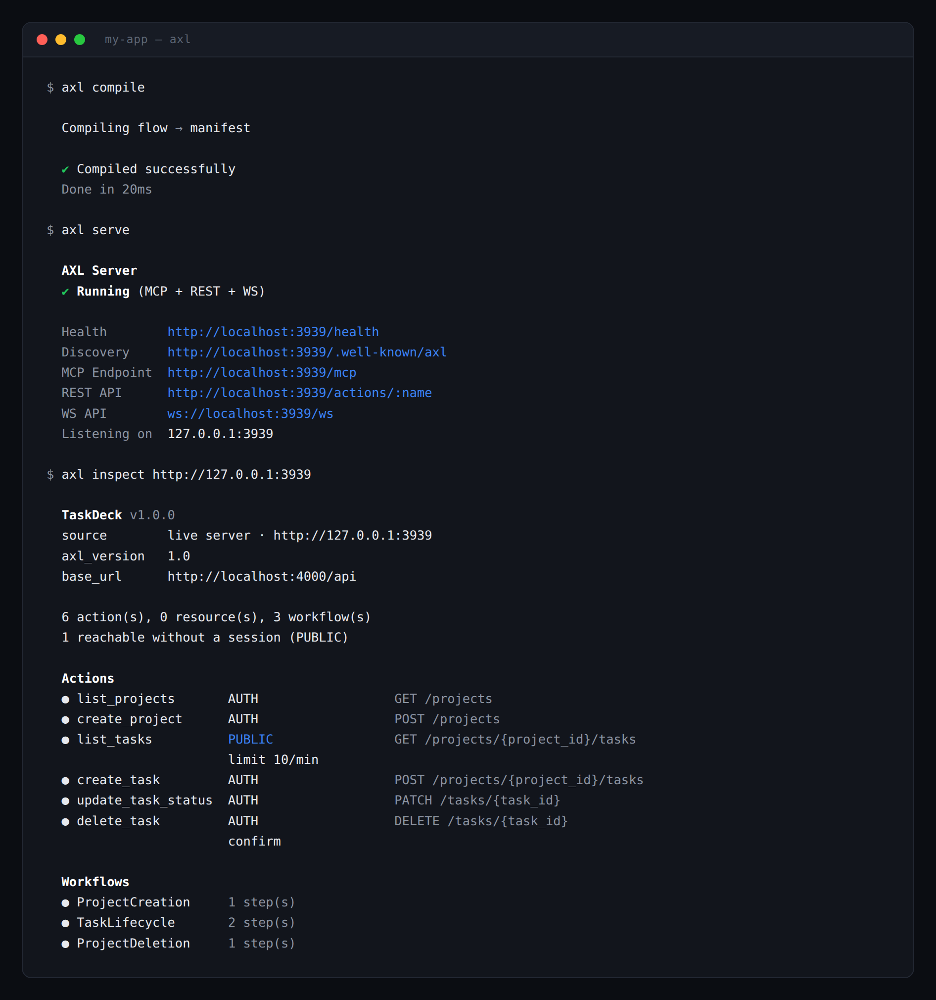

<div align="center">


# AXL

**The AI Execution Layer**

A compiler that turns a declarative `.flow` specification into a permission-aware server
exposing the same capabilities over REST and MCP, proxied to your existing backend.

[](https://github.com/Silvercloud-labs/axl/actions/workflows/ci.yml)
[](LICENSE)
[](.nvmrc)
[](CONTRIBUTING.md#running-the-suite)

[How it works](OVERVIEW.md) ·
[Quick start](#quick-start) ·
[Documentation](#documentation) ·
[FAQ](FAQ.md) ·
[Specification](SPECIFICATION.md) ·
[Contributing](CONTRIBUTING.md)

</div>

<p align="center">
  English ·
  <a href="docs/i18n/es/README.md">Español</a> ·
  <a href="docs/i18n/zh-CN/README.md">简体中文</a> ·
  <a href="docs/i18n/zh-TW/README.md">繁體中文</a> ·
  <a href="docs/i18n/ja/README.md">日本語</a> ·
  <a href="docs/i18n/ko/README.md">한국어</a> ·
  <a href="docs/i18n/vi/README.md">Tiếng Việt</a> ·
  <a href="docs/i18n/hi/README.md">हिन्दी</a> ·
  <a href="docs/i18n/bn/README.md">বাংলা</a> ·
  <a href="docs/i18n/te/README.md">తెలుగు</a> ·
  <a href="docs/i18n/ar/README.md">العربية</a> ·
  <a href="docs/i18n/it/README.md">Italiano</a> ·
  <a href="docs/i18n/pt-BR/README.md">Português (Brasil)</a> ·
  <a href="docs/i18n/fr/README.md">Français</a> ·
  <a href="docs/i18n/ru/README.md">Русский</a> ·
  <a href="docs/i18n/tr/README.md">Türkçe</a>
</p>



---

AXL is a **compiler**, not a runtime reimplementation of MCP.

You declare your application's capabilities once, in `.flow` files. The compiler lexes,
parses and validates them into a single `manifest.json`. The AXL runtime reads only that
manifest and serves it simultaneously as a REST API and as an MCP server — both backed by
your own backend, which AXL calls over HTTP.

```flow
ACTION delete_task
  DESC "Permanently delete a task"
  INPUT
    task_id : String REQUIRED DESC "ID of the task to delete"
  OUTPUT Null
  ENDPOINT DELETE /tasks/{task_id}
  IRREVERSIBLE true
```

```flow
PERMISSION delete_task : AUTH
CONFIRM    delete_task : OTP
RATE_LIMIT delete_task : 5/min
```

Those two blocks produce, from one source:

| Surface | Result |
|---|---|
| REST | `POST /actions/delete_task`, session-gated, OTP-gated, rate-limited |
| MCP | a `delete_task` tool with a typed schema and an `IRREVERSIBLE` note in its description |
| Discovery | an entry in `manifest.json`, served at `/.well-known/axl` and `/.well-known/mcp` |
| Events | `action.started` / `action.completed`, scoped to the calling session |

### One source, two protocols

REST and MCP are served from the same manifest by the same engine. They cannot drift apart,
because there is only one implementation to drift from. The common failure of a
hand-maintained pair — a permission check that exists on one path and not the other — is
not representable.

### Permissions are part of the spec, not an afterthought

`PERMISSION` is **required** on every action and every resource; there is no default. A
spec that forgets one does not compile. Confirmation gates, rate limits and consequence
metadata live beside the capability they govern, in the same file, reviewed in the same
diff.

### Compile time, not request time

The runtime consumes `manifest.json` and nothing else. It never sees a `.flow` file, and the
compiler never runs in production. A malformed spec cannot reach a running server, because
the artefact a running server loads cannot be produced from one.

---

## Quick start

Requires **Node.js 20.19.0 or later**.

> **Not on npm yet.** `scl-axl` has not had its first release, so install from source. See
> [docs/installation.md](docs/installation.md).

```bash
git clone https://github.com/Silvercloud-labs/axl.git
cd axl
npm install
npm run build
npm link --workspace=scl-axl

axl --version
# axl 1.7.0
```

Scaffold, compile and serve a project:

```bash
mkdir my-app && cd my-app
axl init -y
axl compile        # → build/manifest.json
axl serve          # REST + MCP + WebSocket on 127.0.0.1:3939
```

Then read what you just exposed:

```bash
axl inspect http://127.0.0.1:3939
```

The line that matters most is **"reachable without a session"**. Every `PUBLIC` action is an
unauthenticated proxy to your backend. Read it before every deploy.

The server binds **loopback only** by default, on both `127.0.0.1` and `::1`. Widening it is
an explicit `--host`.

Full walkthrough: [docs/quickstart.md](docs/quickstart.md).

---

## Documentation

| Guide | Contents |
|---|---|
| [Installation](docs/installation.md) | npm, pnpm, bun, from source, and the VS Code extension |
| [Quick start](docs/quickstart.md) | A project from empty directory to first REST and MCP call |
| [The `.flow` language](docs/language.md) | `ACTION`, `RESOURCE`, `ENTITY`, types, consequence metadata |
| [Workflows and control flow](docs/workflows.md) | `WORKFLOW`, `IF`/`SWITCH`, `PARALLEL`, confirmation gates |
| [Permissions and rate limiting](docs/permissions.md) | The four permission levels, quota keying, safe defaults |
| [Architecture](docs/architecture.md) | Compiler and runtime, and the boundary between them |
| [Wire protocol](docs/protocol.md) | Discovery, headers, MCP surface, events, RFC 7807 errors |
| [CLI reference](docs/cli.md) | Every command and flag |
| [Importing an existing API](docs/adapt.md) | `axl adapt openapi`, and why every import needs review |
| [Working with an AI agent](docs/agents.md) | Guidance for agents writing `.flow` in your project |

Start with **[OVERVIEW.md](OVERVIEW.md)** if you want the whole picture in one read — what
AXL is for, how the compiler and runtime fit together, the lifecycle of a request, and what
a person, an agent and an operator each see. Every output in it is captured from a real run.

| Reference | Contents |
|---|---|
| [OVERVIEW.md](OVERVIEW.md) | How AXL works, end to end, with diagrams and real output |
| [SPECIFICATION.md](SPECIFICATION.md) | The formal `.flow` language specification |
| [FAQ.md](FAQ.md) | Licensing, scope, production readiness, design decisions |
| [CHANGELOG.md](CHANGELOG.md) | Release history |
| [CONTRIBUTING.md](CONTRIBUTING.md) | Development workflow and standards |
| [SECURITY.md](SECURITY.md) | Vulnerability reporting, and what is out of scope |
| [CODE_OF_CONDUCT.md](CODE_OF_CONDUCT.md) | Community standards |

### Examples

Every example compiles in CI (`npm run examples:compile`).

| Example | Demonstrates |
|---|---|
| [hotel-booking](examples/hotel-booking) | The whole feature set: all four permission levels, both primitives, confirm gates, `PARALLEL`, `SWITCH`, `IRREVERSIBLE` |
| [taskdeck](examples/taskdeck) | A small, realistic project — the shape most codebases start at |
| [bananazon](examples/bananazon) | An e-commerce action catalogue |
| [payment-checkout](examples/payment-checkout) | An asynchronous, externally-completed payment split across workflow steps |

---

## What AXL is not

Scope boundaries are deliberate. Each of these is a decision, not a gap awaiting a patch.

| Not in scope | Why |
|---|---|
| Auth, payments, identity infrastructure | Backend concerns. AXL never issues, stores or verifies a credential |
| OAuth integrations | Owned entirely by the backend. AXL proxies to what already exists |
| A database or ORM | AXL holds no domain data. State is limited to pending confirmations, paused workflows, idempotency and rate-limit buckets |
| Full MCP parity | No Prompts, Notifications, Progress tracking or Roots. AXL is intentionally narrower than MCP |
| Application-code analysis | `axl adapt` reads API specifications, not Express/Prisma/Spring source |
| Compensating transactions | A failed workflow does not roll back completed steps. Failures name what already committed |

More in the [FAQ](FAQ.md).

---

## Repository layout

npm workspaces monorepo.

```
axl/
├── packages/
│   ├── compiler/     @silvercloudlabs/compiler    lexer, parser, validator, manifest generator
│   ├── runtime/      @silvercloudlabs/runtime     engine, transport adapters, state stores
│   ├── cli/          scl-axl          the `axl` binary and every subcommand
│   ├── generators/   @silvercloudlabs/generators  generator registry and implementations
│   └── vscode/       axl-flow         VS Code extension
├── examples/         runnable .flow projects, all compiled in CI
├── fixtures/         inputs owned by the test suite
├── docs/             guides and reference
├── scripts/          maintenance and verification scripts
└── test/             vitest suites
```

All six package manifests version in **lockstep** — a change to any package bumps all of
them, in exchange for a version number that means something across the whole toolchain.
`test/versions.test.ts` enforces it.

---

## Development

```bash
git clone https://github.com/Silvercloud-labs/axl.git
cd axl
npm install
npm run build
npx vitest run --no-file-parallelism
```

| Task | Command |
|---|---|
| Build everything | `npm run build` |
| Run tests | `npx vitest run --no-file-parallelism` |
| Packaging check | `npm run test:packaging` |
| Package the VS Code extension | `npm run package:vscode` |

**Run tests serially.** Several suites bind fixed ports; in parallel they collide and produce
`EADDRINUSE` failures that look like real regressions but are not.

See [CONTRIBUTING.md](CONTRIBUTING.md) for the full workflow, versioning policy and pull
request process.

---

## Community and support

| | |
|---|---|
| Questions, ideas, feature requests | [GitHub Issues](https://github.com/Silvercloud-labs/axl/issues) |
| Bug reports | [GitHub Issues](https://github.com/Silvercloud-labs/axl/issues) — a minimal `.flow` file that reproduces it is worth more than a description |
| Security vulnerabilities | [Private advisory](https://github.com/Silvercloud-labs/axl/security/advisories/new), never a public issue. See [SECURITY.md](SECURITY.md) |
| Contributing | [CONTRIBUTING.md](CONTRIBUTING.md) |

---

## License

**Apache License 2.0.** See [LICENSE](LICENSE) and [NOTICE](NOTICE).

Apache 2.0 rather than MIT for two reasons that matter for a language and compiler
specifically: it grants patent rights explicitly, protecting both contributors and adopters,
and it protects the "AXL" name — neither of which MIT provides. It remains a permissive,
OSI-approved open-source licence: free to use, modify, redistribute and sell, including
commercially.

Copyright 2026 Silvercloud Labs.
