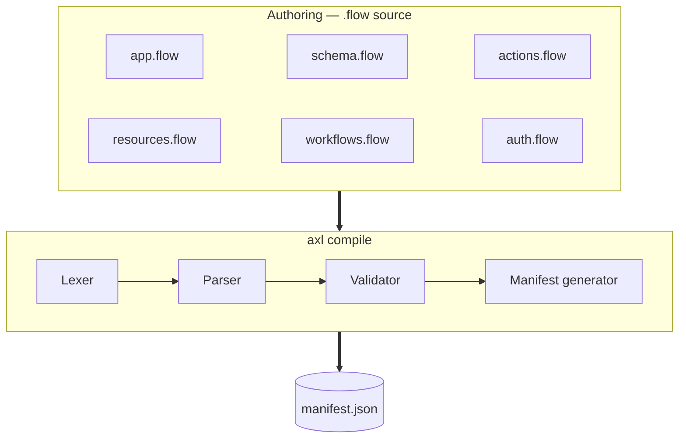
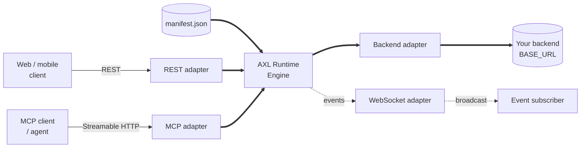

# Architecture

AXL has two halves that never run at the same time. The compiler runs on your machine and
produces `manifest.json`. The runtime reads that file and serves it. Nothing crosses the
line in either direction.

---

## Build time

The compiler is four stages in sequence. A failure at any stage stops the build with a
diagnostic code, a file and a line; it never emits a partial manifest.

## Run time

The engine is transport-agnostic. Validation, permission checks, confirmation gates, rate
limits and idempotency all live in the engine, so REST and MCP cannot diverge on any of
them — there is only one implementation to diverge from.

---

## Compilation is a hard boundary

The runtime consumes `manifest.json` and nothing else. It never sees a `.flow` file, and
the compiler never runs in production.

This is what makes validation a **build-time guarantee** rather than a request-time check.
A malformed spec cannot reach a running server, because the artefact a running server
loads cannot be produced from one.

## Two RPC transports, not three

REST and MCP can both invoke actions. **The WebSocket adapter cannot.**

Its only inbound message type is `ping`, to which it replies `pong`. Everything else it
does is server-to-client event broadcast. There is no way to call an action over `/ws`, and
this is deliberate: a third invocation path would be a third place for the permission
model to be applied slightly differently.

## Where state lives

AXL holds no domain data. Everything it persists is mechanism, not content:

| Store | Contents | TTL |
|---|---|---|
| Pending confirmations | Requester key and OTP for a gated action awaiting its second call | 5 minutes |
| Paused workflows | Cursor and accumulated step outputs for a workflow stopped at a gate | 24 hours |
| Idempotency cache | Prior results keyed by `Idempotency-Key` and session | 24 hours |
| Rate-limit buckets | Request counts per IP, and per session where one exists | The declared window |

Your data stays in your backend. AXL calls it over HTTP and forwards what comes back.

---

## Related

- [The `.flow` language](language.md) — what you write
- [Wire protocol](protocol.md) — what a client sees
- [Permissions and rate limiting](permissions.md) — how the engine gates a call
- [SPECIFICATION.md](../SPECIFICATION.md) — the formal language specification
