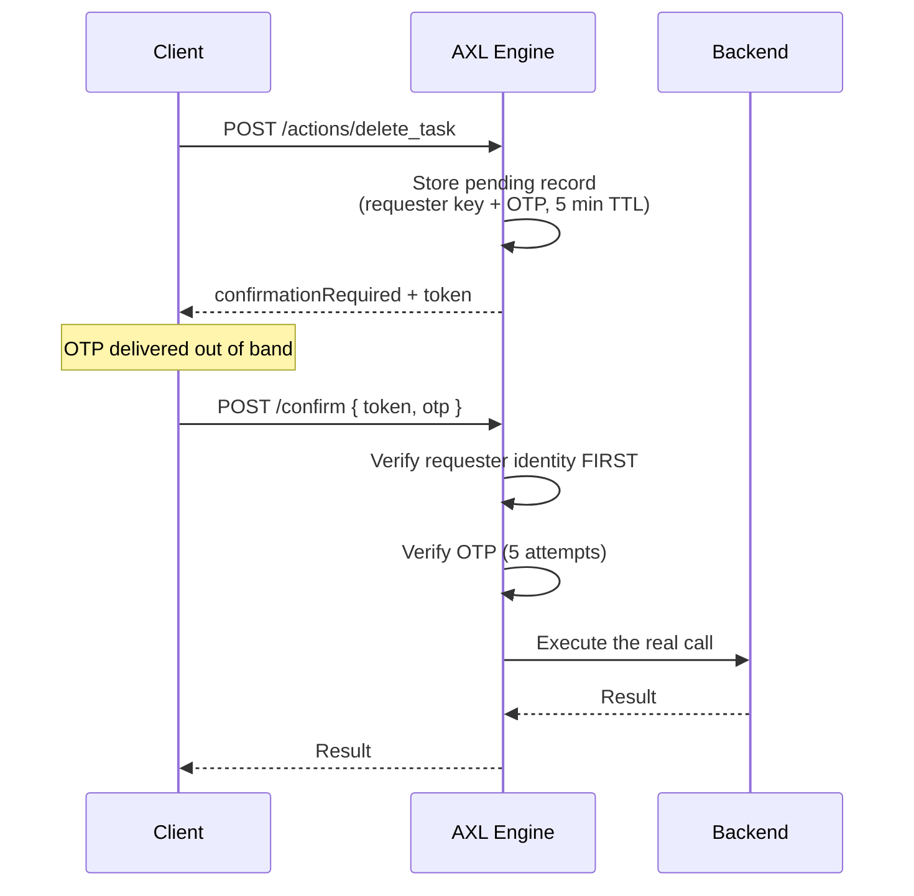

# Workflows and control flow

A workflow orders actions and binds their outputs together. It runs **inline** on the
originating HTTP request — there is no background worker and no durable scheduler.

```flow
WORKFLOW CheckoutFlow
  STEP create_order
  STEP charge_card USING order_id = create_order.id RETRY 3 TIMEOUT 2000
  IF create_order.express
    STEP expedite_shipping USING order_id = create_order.id
  ELSE
    STEP standard_shipping USING order_id = create_order.id
  END
END
```

Start one with `POST /workflows/CheckoutFlow`.

---

## Step forms

| Form | Purpose |
|---|---|
| `STEP <action>` | Invoke an action |
| `USING <input> = <step>.<field>` | Bind an argument from an earlier step's output |
| `RETRY <n>` | Retry on backend failure |
| `TIMEOUT <ms>` | Deadline per attempt |
| `WAIT <ms>` | Fixed pause |
| `IF` / `ELSE` / `END` | Two-way branch |
| `SWITCH` / `CASE` / `DEFAULT` / `END` | Multi-way branch |
| `PARALLEL` / `END` | Concurrent block |

`USING` must come first. `RETRY` and `TIMEOUT` may appear in either order.

---

## Semantics worth knowing before you rely on them

| Construct | Behaviour |
|---|---|
| `RETRY` | Retries **only** `BackendError` and `TimeoutError`. Validation, permission and rate-limit failures are properties of the request and fail identically every time. Flat 250 ms delay, so the worst case is `(n-1) × 250ms`. |
| `TIMEOUT` | A real deadline via `AbortController`, not `Promise.race` — the backend request is genuinely cancelled, covering the body read. Applied **per attempt**, not per step. |
| `WAIT` | Holds the originating HTTP request open. Event-based waiting is a compile error (`AXL374`), not an omission — it needs a durable scheduler that does not exist. |
| `SWITCH` | Compares values **stringified**, so `CASE 2` matches numeric `2`. `null` matches nothing. No match and no `DEFAULT` is a runtime error, never silent fall-through. |
| `PARALLEL` | Fail-fast, implemented with `allSettled` so siblings are never left running unobserved. |

`RETRY` retrying only two error classes is the one most often misread. A `RETRY 3` on an
action that fails validation makes exactly one call, not three — retrying a request that is
malformed by construction only multiplies the load.

---

## Multi-way branching

```flow
WORKFLOW PostStayFollowUp
  STEP fetch_stay
  SWITCH fetch_stay.rating
    CASE 5
      STEP request_public_review USING stay_id = fetch_stay.id
    CASE 1
      STEP open_service_ticket USING stay_id = fetch_stay.id
    DEFAULT
      STEP send_thanks USING stay_id = fetch_stay.id
  END
END
```

Comparison is stringified, so `CASE 5` matches both `5` and `"5"`. That is a deliberate
choice: a JSON backend returning `"5"` where the spec author wrote `CASE 5` is the common
case, and failing to match would look like the branch silently vanishing.

---

## PARALLEL

```flow
PARALLEL
  STEP charge_card   USING id = create_order.id
  STEP reserve_stock USING id = create_order.id
END
```

The restrictions below are load-bearing, not stylistic. Each disallows an ambiguous case
rather than inventing a semantics for it, which is why the block needs no new persisted
state.

| Code | Rule | Reason |
|---|---|---|
| `AXL381` | No `CONFIRM` inside a block | A pause writes one record keyed by one token; two members pausing would need two, and finished members have committed side effects that cannot be replayed |
| `AXL382` | No duplicate action inside one block | Step outputs are keyed by action name; two concurrent copies would race for one key |
| `AXL383` | Only `STEP` inside | `IF`, `SWITCH`, `WAIT` and nesting each branch or park the cursor |
| `AXL384` | At least two steps | One step is just that step |
| `AXL385` | Block must be closed | — |
| `AXL335` | A member may not bind from a sibling | Members dispatch together; a sibling's output does not exist yet |

> **Sibling side effects are not rolled back.** A member that completed before another
> failed has really called your backend. AXL has no compensation mechanism. The thrown
> error names what committed — `"charge_card already completed and was not rolled back"` —
> because a caller reading only `Backend returned 500` would reasonably assume the block
> was atomic.
>
> If you need atomicity across two backend calls, that transaction belongs in your backend,
> behind one action.

---

## Confirmation gates

An action marked `CONFIRM <name> : OTP` does not execute on first call. It returns a
confirmation envelope, and the caller must present the OTP.



The requester check runs **before** the OTP is read. A mismatch raises the same `NOT_FOUND`
as an unknown token, deliberately, so the endpoint is not a token-existence oracle — and a
stranger holding a leaked token cannot burn the owner's attempt budget.

AXL does not deliver the OTP. Delivery is a backend concern: your action's own
implementation sends the email or SMS. `AXL_DEMO_OTP=1` returns it in the API response for
demonstration only, and is off by default.

### A workflow that hits a gate

A workflow reaching a confirm-gated step pauses. It emits `workflow.paused`, persists its
cursor and accumulated outputs for 24 hours, and returns a resume token. Continue it with
`POST /workflows/resume`.

| Store | TTL |
|---|---|
| Pending confirmations | 5 minutes |
| Paused workflows | 24 hours |

---

## Related

- [The `.flow` language](language.md) — `ACTION`, `RESOURCE`, types
- [Permissions and rate limiting](permissions.md) — what `CONFIRM` composes with
- [Wire protocol](protocol.md) — the confirmation and resume envelopes on the wire
- [examples/hotel-booking](../examples/hotel-booking) — `PARALLEL`, `IF`/`ELSE` and
  `SWITCH` in one project
